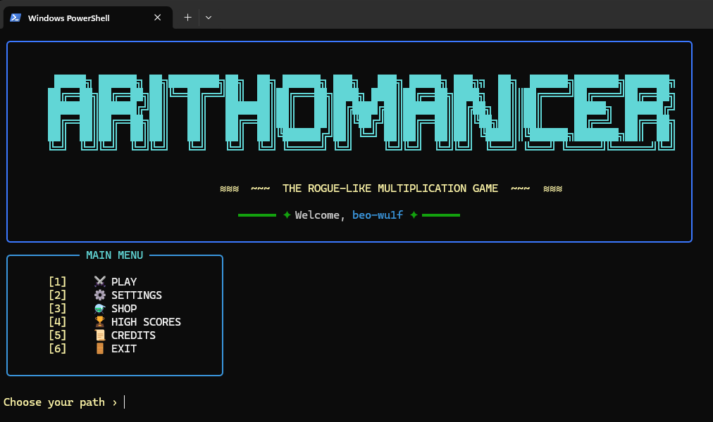
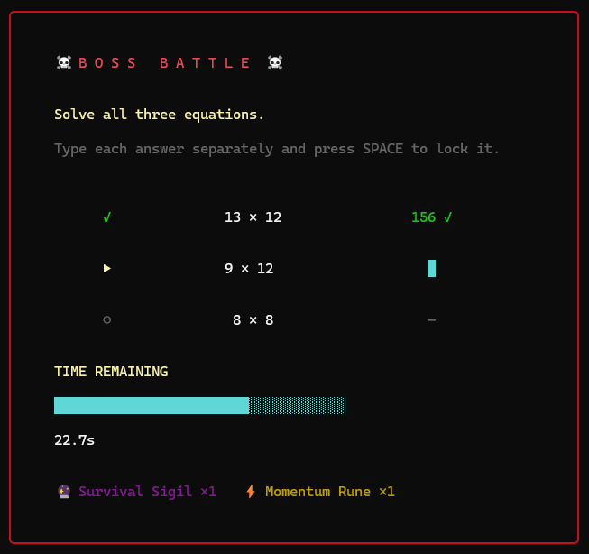
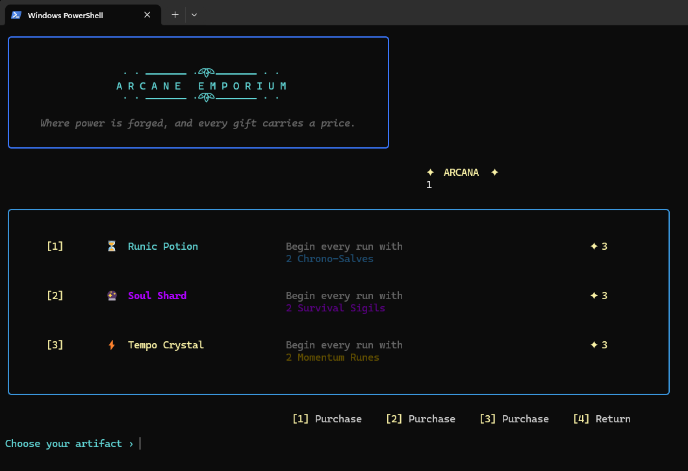

# ⚡ ARITHOMANCER

### *THE ROGUE-LIKE MULTIPLICATION GAME*

> **Think fast. Calculate faster. Survive the Arcana.**

Arithomancer is a terminal-based rogue-like multiplication game built
with Python, where arithmetic becomes combat.

Race against the clock, build your streak, discover powerful abilities,
earn Arcana, purchase upgrades, and fight increasingly dangerous bosses.

Every run is a test of **speed, accuracy, decision-making, and nerve.**

---


<p align="center">
  
</p>

<p align="center">
  <i>The Arcana awaits. How far can you calculate?</i>
</p>

## 🎮 THE GAMEPLAY LOOP

Arithomancer takes the familiar challenge of multiplication tables and
turns it into a race against the clock.

Every run follows a simple principle:

> **Answer correctly. Stay alive. Go further.**

### ⚔️ 1. Enter the Run

Start a new run and prepare to survive as long as possible


### ⏱️ 2. Beat the Clock

Each question gives you a limited amount of time to answer.

Correct answers keep the run alive and can build your available time,
while hesitation and mistakes put your run at risk.

### 🔥 3. Build Your Momentum

Maintain a streak of correct answers and unlock opportunities to
strengthen your run.

The longer you survive, the more dangerous the challenge becomes.

### 🔮 4. Discover Powers

As your run progresses, you'll encounter powerful abilities that can
change the way you play.

Choose carefully — you won't be able to take everything.

### 💎 5. Earn Arcana

Survive challenges and earn **Arcana**, the currency that powers your
long-term progression.

### 🛒 6. Visit the Shop

Spend your Arcana on upgrades and permanent purchases that can make
future runs stronger.

### 👹 7. Face the Boss

Reach a boss encounter and prove that your arithmetic skills can survive
under serious pressure.

Defeat the boss and continue your journey.

Lose...

**and the run ends.**

---

## 👹 BOSS BATTLES

Surviving the ordinary challenges is only part of the journey.

At key points during a run, the Arithomancer must face a **Boss Battle** —
a special encounter designed to put everything you've learned to the
test.

<p align="center">
  
</p>

<p align="center">
  <i>The numbers have teeth now.</i>
</p>

### ⚔️ A Different Kind of Challenge

Boss battles break up the normal rhythm of the run and introduce a
more demanding encounter.

The objective is simple:

> **Defeat the boss before the boss defeats your run.**

Every correct answer matters.

Every mistake brings you closer to defeat.


### 🏆 Defeat the Boss

Survive the encounter and your journey continues.

The victory is more than just another correct answer — it's a milestone
in the run and a chance to push deeper into Arithomancer.

But if the boss wins...

> **Your journey ends.**

---

## 🔮 POWERS, ITEMS & MOMENTUM

Arithomancer isn't just about answering questions.

As the run progresses, you gain access to powerful abilities that can
change how you survive the challenges ahead.

Some abilities help you recover from mistakes.

Others reward accuracy, build momentum, or give you another way to
survive when the clock is running out.

### ⚡ Build Your Run

Every run can develop differently depending on the abilities you acquire.

You won't have access to everything — you'll have to make choices.

The challenge isn't simply:

> **"Can I solve this equation?"**

It's also:

> **"Which powers will help me survive the next one?"**

### 🔮 Temporary Run Items

Items acquired during a run are part of that run only.

When the run ends, these temporary items are reset.

This keeps every new run fresh and prevents a single successful run from
permanently accumulating an enormous inventory.

### 💎 Arcana

Successful progress earns **Arcana**, the persistent currency of
Arithomancer.

Unlike temporary run items, Arcana survives the end of a run.

This creates a distinction between:

```text
                 YOUR PROFILE
                      │
              ┌───────┴───────┐
              │               │
           💎 ARCANA      🛡️ RUN ITEMS
              │               │
              │               └── Temporary
              │
              └── Persistent

```
<p align="center">
  
</p>

<p align="center">
  <i>Where power is forged, and every gift carries a price.</i>
</p>

### 🛒 The Arcane Emporium

Arcana can be spent at the **Arcane Emporium**, where powerful
artifacts can be purchased to shape your future runs.

These purchases provide lasting advantages, allowing your profile to
become stronger over time.

But Arcana is limited.

Spend it carefully.

> **Power is permanent. Arcana is not infinite.**
> 

---

## 💾 PROFILES & PERSISTENT PROGRESSION

Arithomancer remembers your journey.

Create a profile and your progression is stored locally, allowing you to
leave the game and return to your adventure later.

### 🧙 Multiple Profiles

Arithomancer supports multiple player profiles.

Each profile maintains its own progression, including:

- 💎 Arcana
- 🛒 Purchased artifacts
- 📊 Progression through the game
- 🏆 High-Score Leaderboard

You can create, switch between, and remove profiles directly from the
game's settings.

### 🔄 Persistent vs Temporary Progress

Arithomancer deliberately separates **run progression** from
**profile progression**.

```text
                 YOUR PROFILE
                      │
          ┌───────────┴───────────┐
          │                       │
          ▼                       ▼
       💎 ARCANA             🛒 PURCHASES
       Persistent             Persistent
          │                       │
          └───────────┬───────────┘
                      │
                      ▼
                 NEW RUN
                      │
              ┌───────┴───────┐
              │               │
              ▼               ▼
        🔮 Run Items      ⚔️ Run Progress
         Temporary          Temporary

---
```

## 🛠️ TECHNICAL ARCHITECTURE

Arithomancer is a terminal-based game built entirely in Python, with a
focus on modular game logic, persistent local data, and a rich terminal
interface.

### 🐍 Core Technology

| Technology | Purpose |
|------------|---------|
| **Python** | Core game logic and application flow |
| **Rich** | Terminal UI, panels, tables, colors and live displays |
| **SQLite** | Local profiles, progression and high scores |
| **readchar** | Keyboard input and interactive menus |
| **threading** | Timer and real-time gameplay behaviour |
| **msvcrt** | Low-level keyboard handling on Windows |

### 🧩 Project Structure

The game is separated into different responsibilities rather than being
handled entirely inside one giant game loop.

```text
Arithomancer/
│
├── arithomancer.py
│   ├── Main Menu
│   ├── Gameplay
│   ├── Boss Battles
│   ├── Shop
│   ├── Settings
│   └── Profile Management
│
├── database.py
│   ├── Profile Storage
│   ├── Profile Retrieval
│   ├── Progression Saving
│   └── High Scores
│
├── requirements.txt
├── .gitignore
├── LICENSE
├── README.md
│
└── assets/
    ├── main-menu.png
    ├── boss-battle.png
    └── arcane-emporium.png

```

## 🚀 INSTALLATION & SETUP

### 📋 Requirements

Before running Arithomancer, you'll need:

- **Python 3.10 or newer**
- **Windows**

Arithomancer currently uses Windows-specific keyboard handling through
Python's built-in `msvcrt` module.

### 📥 1. Clone the Repository

Clone the repository and move into the project directory:

```bash
git clone https://github.com/beo-wu1f/Arithomancer.git
cd Arithomancer
```

### ⚙️ 2. Create a Virtual Environment

```bash
python -m venv .venv
```
Activate it in Windows PowerShell:
```bash
.venv\Scripts\Activate.ps1
```
### 🛠️ 3. Install Dependencies
```bash
pip install -r requirements.txt
```
### 🚀 4. Launch Arithomancer
```bash
python arithomancer.py
```
That's it. 🎮

On the first launch, Arithomancer will automatically create its local
SQLite database.

---


## 🎮 CONTROLS

Arithomancer is designed around simple keyboard-first interaction.

### 🧭 Menus

| Key | Action |
|-----|--------|
| `1–9` | Select a menu option |
| `ENTER` | Confirm input / continue |

### ⚔️ Gameplay

| Key | Action |
|-----|--------|
| `0–9` | Enter your answer |
| `BACKSPACE` | Edit your answer |
| `ENTER` | Submit your answer |

### 👹 Boss Battles

Boss encounters use their own interaction flow, including the ability
to lock in answers during the encounter.

---

## 🧠 HOW THE GAME WORKS

Arithomancer combines fast mental arithmetic with roguelike progression.

A run is built around a simple loop:

```text
             🧙 PROFILE
                 │
                 ▼
             🎮 START RUN
                 │
                 ▼
          🧮 SOLVE CHALLENGE
                 │
          ┌──────┴──────┐
          │             │
       CORRECT        WRONG
          │             │
          ▼             ▼
       REWARDS       PENALTY
          │             │
          └──────┬──────┘
                 │
                 ▼
          🔥 CONTINUE RUN
                 │
                 ▼
             👹 BOSS
                 │
          ┌──────┴──────┐
          │             │
        VICTORY       DEFEAT
          │             │
          ▼             ▼
      PROGRESSION     RUN ENDS
          │
          ▼
       🛒 SHOP
          │
          ▼
       NEXT RUN
```
---

## 🗄️ DATABASE & PERSISTENCE

Arithomancer uses **SQLite** to handle persistent game data.

The database is managed through a dedicated `database.py` module, keeping
data operations separate from the main game logic.

### 💾 What Gets Saved?

Each profile maintains its own persistent progression.

| Data | Persistent? | Description |
|------|-------------|-------------|
| 👤 Profile | ✅ | Player identity and profile |
| 💎 Arcana | ✅ | Persistent in-game currency |
| 🛒 Purchased items | ✅ | Permanent shop progression |
| 🏆 High scores | ✅ | Local leaderboard records |
| ⚔️ Current run | ❌ | Resets when the run ends |
| 🔮 Temporary run items | ❌ | Reset between runs |
| ⏱️ Timer | ❌ | Exists only during the current run |

### 🔄 Profile Persistence

When a profile is created, its progression is stored in the local
SQLite database.

Whenever persistent data changes — such as purchasing an item — the
profile is updated automatically.

Loading the profile restores its saved progression.

This allows multiple players to maintain separate journeys on the same
installation.

### 🧩 Database Layer

The game's database operations are separated into `database.py`.

The main game communicates with the database through functions rather
than handling all SQL operations directly.

```text
                 arithomancer.py
                       │
                       │
                 Profile / Score
                  operations
                       │
                       ▼
                  database.py
                       │
                       │ SQL
                       ▼
                arithomancer.db
                       │
             ┌─────────┴─────────┐
             ▼                   ▼
          Profiles          High Scores
             │
      ┌──────┴──────┐
      ▼             ▼
   Arcana       Purchases
```
---

## 🧩 TECHNICAL HIGHLIGHTS

Arithomancer combines several Python concepts and technologies to create
a real-time terminal game rather than a simple command-line quiz.

### 🖥️ Rich Terminal UI

The game uses **Rich** to build an interactive terminal interface with:

- Styled panels and borders
- Tables
- Colors and typography
- Live-updating displays
- Formatted game states
- Custom terminal menus

The interface is designed to make a terminal application feel closer to
a traditional game UI.

### ⏱️ Real-Time Gameplay

Timed challenges require the game to process player input while
simultaneously managing countdown timers and gameplay state.

Python's `threading` capabilities are used to support real-time
behaviour without blocking the rest of the game.

### 🗄️ SQLite Persistence

SQLite provides lightweight local persistence without requiring a
separate database server.

The game uses it for:

- Profile management
- Persistent Arcana
- Permanent purchases
- High scores

### 🧠 Game State Management

The game maintains different types of state throughout a run, including:

- Current question
- Timer
- Answer state
- Streak / momentum
- Temporary items
- Boss encounters
- Persistent profile progression

Separating temporary run state from persistent profile data allows the
game to reset a run without losing long-term progression.

### 👤 Profile System

Multiple profiles can exist within the same installation.

Players can:

- Create profiles
- Switch profiles
- Delete profiles
- Continue their individual progression

Each profile maintains its own persistent progression.

### 👹 Encounter System

Boss encounters introduce a different gameplay flow from standard
questions.

This required the game to transition between different interaction
states while maintaining the same underlying run.

### 🧩 Modular Database Layer

Database functionality is kept in `database.py` rather than being
spread throughout the main game file.

This separation makes the persistence layer easier to maintain and keeps
the main gameplay code focused on the game itself.

---

## 🛠️ DESIGN DECISIONS & CHALLENGES

Arithomancer started as a simple idea: take multiplication practice and
make it feel like an actual game.

As the project grew, that simple idea turned into a much larger challenge:
how do you make a terminal-based arithmetic game feel like a roguelike?

Several design decisions shaped the final version.

### 🖥️ Why a Terminal Game?

The terminal was part of the challenge.

Instead of relying on a graphical game engine, Arithomancer builds its
interface entirely inside the terminal using Python and Rich.

This forced the project to solve problems that a traditional GUI would
normally handle automatically — layout, visual hierarchy, input handling,
timers, menus, and screen updates.

The result is intentionally simple under the hood while still providing
a game-like interface.

### 💾 Why SQLite?

Persistent progression quickly became more complicated than a few values
stored in memory.

Profiles, Arcana, permanent purchases, and high scores all needed to
survive between sessions.

SQLite provided a lightweight solution without requiring a separate
database server or external service.

It also gave the project an opportunity to practice working with a real
relational database inside a standalone Python application.

### 🔮 Why Separate Permanent and Temporary Progression?

One of the central design decisions was separating **profile progression**
from **run progression**.

Permanent progression gives the player a reason to keep returning.

Temporary items and run state reset when a run ends, keeping each new
attempt meaningful.

This creates a balance between:

> **"I am getting stronger."**

and

> **"I still have to survive this run."**

### 👤 Why Profiles?

Once progression became persistent, supporting multiple profiles became
a natural extension.

Profiles allow different players to maintain independent progression
without requiring separate installations or databases.

The profile system also makes the save data feel like part of the game
rather than simply being a collection of configuration values.

### 👹 Designing Boss Battles

Boss battles were introduced to break up the normal rhythm of the game.

Instead of answering an endless sequence of ordinary multiplication
questions, the player eventually enters a dedicated encounter with
different rules and presentation.

This required the game to transition between different gameplay states
while preserving the player's current run.

### ⏱️ The Timer

The timer is one of the most important design elements in Arithomancer.

Without it, multiplication questions become a conventional quiz.

With it, every question becomes a small decision under pressure.

The player isn't only solving:

> **"What is the answer?"**

They're also solving:

> **"Can I get the answer before time runs out?"**

### 🧩 Iterative Development

Many of Arithomancer's systems were developed incrementally.

Features such as profiles, persistence, shops, items, momentum, and boss
encounters were added and tested individually before being integrated
into the larger game.

This made debugging easier and helped keep the final game playable while
new systems were being introduced.

---

## 🔮 FUTURE IDEAS

Arithomancer is complete in its current form, but there are still
plenty of directions the project could explore in the future.

Possible additions include:

- 👹 More boss encounters with unique mechanics
- 🔮 More powers, artifacts, and item combinations
- ⚔️ Additional encounter types beyond standard questions and bosses
- 🌳 A deeper progression or upgrade system
- 🗺️ A branching run map with meaningful route choices
- 🎲 More randomized events and encounters
- 📊 Expanded statistics and run history
- 🏆 More advanced leaderboard features
- 🎨 Additional terminal visual effects and animations
- 🌐 Cross-platform terminal support

None of these are required for the current game — they're simply
directions Arithomancer could take as the project evolves.

---

## 👨‍💻 WHAT I LEARNED

Arithomancer started as a simple multiplication game.

It gradually grew into a much larger project involving real-time input,
terminal UI design, game-state management, persistent storage, and
progression systems.

Building it taught me a lot about turning a small idea into a complete
application.

### 🐍 Python

I gained practical experience using Python beyond simple scripts,
including:

- Structuring a larger application
- Managing game state
- Working with functions and modules
- Handling real-time input
- Using threads for concurrent behaviour
- Building reusable components

### 🗄️ Databases

Working with SQLite introduced persistent application data into the
project.

I learned how to:

- Design tables for different types of data
- Store and retrieve player progression
- Update persistent data during gameplay
- Separate database operations from game logic

### 🖥️ Terminal UI

Using Rich completely changed what I thought a terminal application
could look like.

I learned how to build:

- Structured layouts
- Styled panels
- Tables
- Menus
- Live displays
- Visual game states

The terminal became part of the game's design rather than simply being
a place to print text.

### 🧠 Debugging & Iteration

Probably the biggest lesson was that building a game is an iterative
process.

Features rarely worked perfectly on the first attempt.

Timers, boss encounters, profiles, persistence, menus, and item systems
all required testing, debugging, and refinement.

Many of the final systems emerged from solving problems encountered
during development.

### 🎮 From Idea to Project

Most importantly, Arithomancer taught me how a small programming idea can
grow into a complete project.

What began as:

> **"What if multiplication practice was a game?"**

eventually became:

> **A terminal-based roguelike with timed combat, bosses, items,
> persistent progression, profiles, and SQLite storage.**

And that transformation is probably the part of the project I'm most
proud of.

---

## 📜 LICENSE

This project is available under the **MIT License**.

See the `LICENSE` file for the full license text.

---

<p align="center">
  <b>⚡ ARITHOMANCER ⚡</b>
  <br>
  <i>The numbers are waiting.</i>
  <br><br>
  ⭐ If you enjoyed the project, consider giving it a star!
</p>